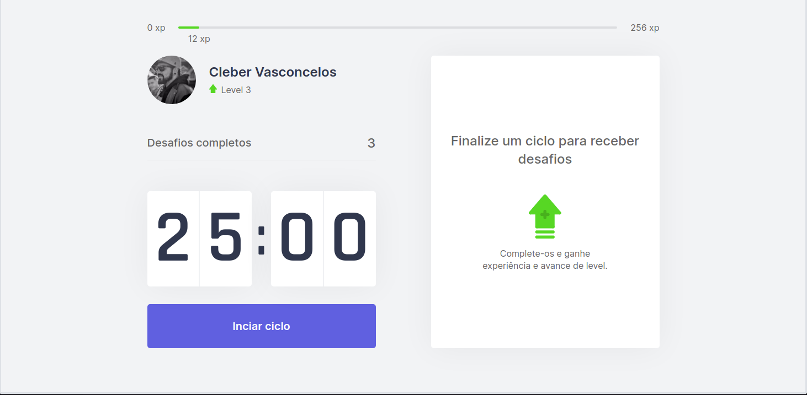
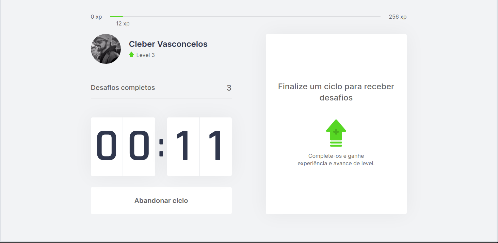
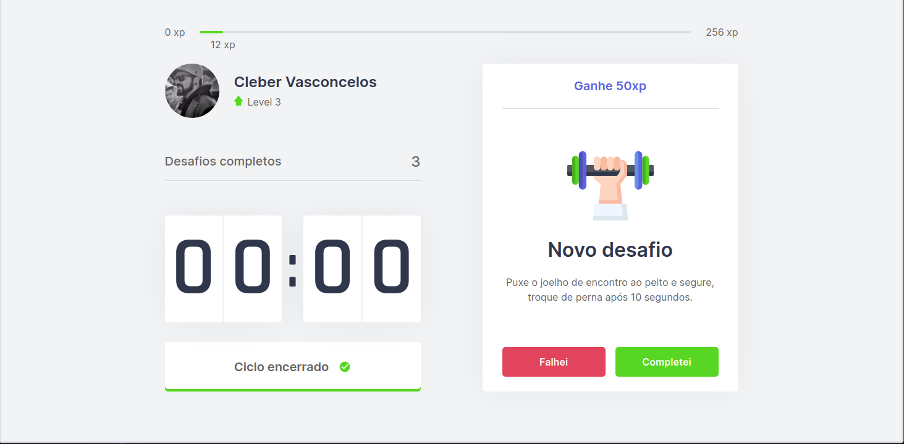

<h1 align="center">
    
</h1>

<h4 align="center"> 
	:heavy_check_mark:  Next Level Week - 4 🚀 Concluído! :heavy_check_mark:
</h4>

<p align="center">	
  <a href="https://www.linkedin.com/in/clebervasconcelos/?locale=xx_XX">
    
  </a>

  <a aria-label="Completed" href="https://nextlevelweek.com/">
    </img>
  </a>
  
  
</p>
<p align="center">
<a href="#-projeto">Projeto</a>&nbsp;&nbsp;&nbsp;|&nbsp;&nbsp;&nbsp;
  <a href="#rocket-tecnologias">Tecnologias</a>&nbsp;&nbsp;&nbsp;|&nbsp;&nbsp;&nbsp;
  <a href="#information_source-como-usar">Como Usar</a>&nbsp;&nbsp;&nbsp;|&nbsp;&nbsp;&nbsp;
  <a href="#memo-licença">Licença</a>
</p>

## 💻 Projeto

O move.it é um app que une a técnica de Pomodoro com a realização de exercícios físicos para quem passa muito tempo na frente do computador.

<h1 align="center">
    <p>Home</p>
    
</h1>

<h1 align="center">
    <p>Ciclo iniciado</p>
    
</h1>

<h1 align="center">
    <p>Fim do ciclo com desafio e ganho de xp</p>
    
</h1>

- [Demonstração](https://pomodoro-moveit-ten.vercel.app/)

## :rocket: Tecnologias

Esse projeto foi desenvolvido com as seguintes tecnologias:

- [React](https://reactjs.org)
- [Next.js](https://nextjs.org/)
- [TypeScript](https://www.typescriptlang.org/)
- [css](https://www.w3schools.com/css/)

## :information_source: Como usar

```bash
# Clone o repositorio
$ git clone https://github.com/clebervasc/nlw-4-move.it

# Acesse a pasta do repositorio
$ cd nlw-4-move.it

# instale as dependencias
$ yarn install

# Start o server
$ yarn dev

# Agora você pode acessar [`localhost:3000`](http://localhost:3000) do seu navegador.

# Alternar nome e avatar
Acesse o arquivo: src/components/Profile.tsx
```

## :memo: licença

Esse projeto está sob a licença MIT. Veja o arquivo [LICENSE](LICENSE.md) para mais detalhes.

Feito com ♥ por Cleber Vasconcelos :wave: [Dê um "alô"](https://www.linkedin.com/in/clebervasconcelos/?locale=xx_XX)
